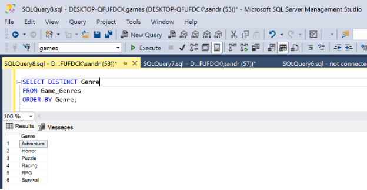
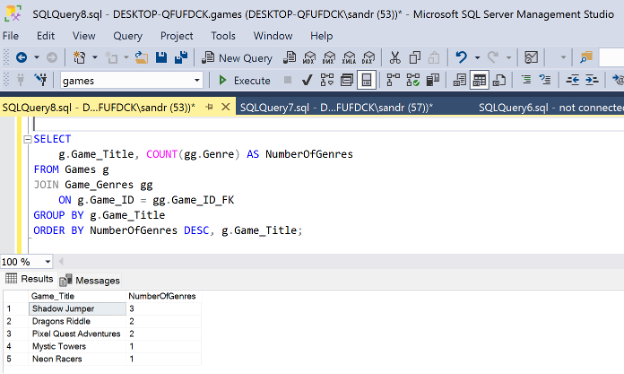
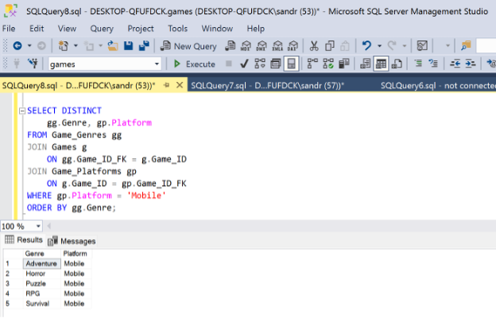
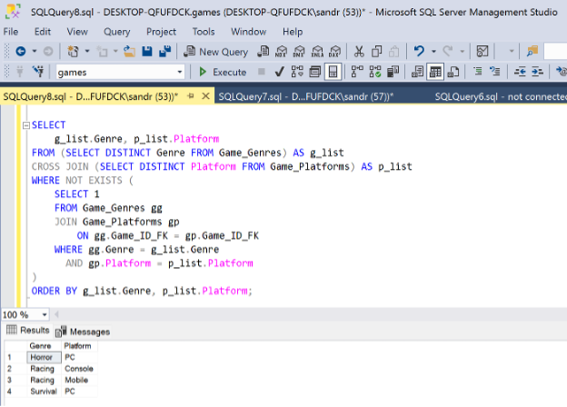
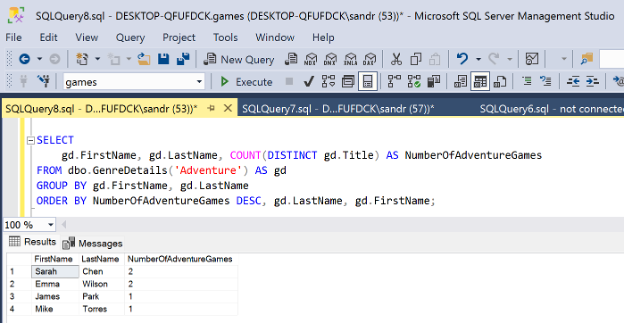
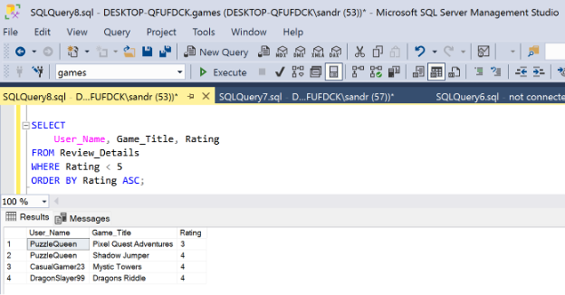
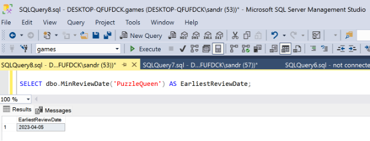
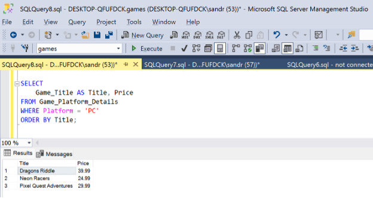

# SQL Query Execution

This section demonstrates the SQL queries required by the database project assignment and the results generated in SQL Server Management Studio (SSMS).

---

## Query 1: List all genres

Displays all genres present in the database.

---

## Query 2: Number of genres per game

Displays each game and the number of genres associated with it, ordered from most to least.

---

## Query 3: Genres available on Mobile

Displays the genres of games available on the Mobile platform.

---

## Query 4: Genres NOT available on each platform

Displays genres that are not available on each platform.

---

## Query 5: Update player hours using AddHoursToPlayer procedure

Players 1 and 2 played 10 additional hours. The stored procedure was used to update their total hours played.

---

## Query 6: Verify updated hours

Displays the updated total hours played for Players 1 and 2.

---

## Query 7: Developers who worked on adventure games

Uses the `GenreDetails` function to display developers who worked on adventure games and the number of adventure games they contributed to.

---

## Query 8: Users who rated games below 5

Uses the `Review_Details` view to list users who gave a rating lower than 5.

---

## Query 9: Earliest review date for PuzzleQueen

Uses the `MinReviewDate` function to find the earliest review date for the user "PuzzleQueen".

---

## Query 10: Games available on PC with prices

Uses the `Game_Platform_Details` view to display all games available on PC and their prices.

