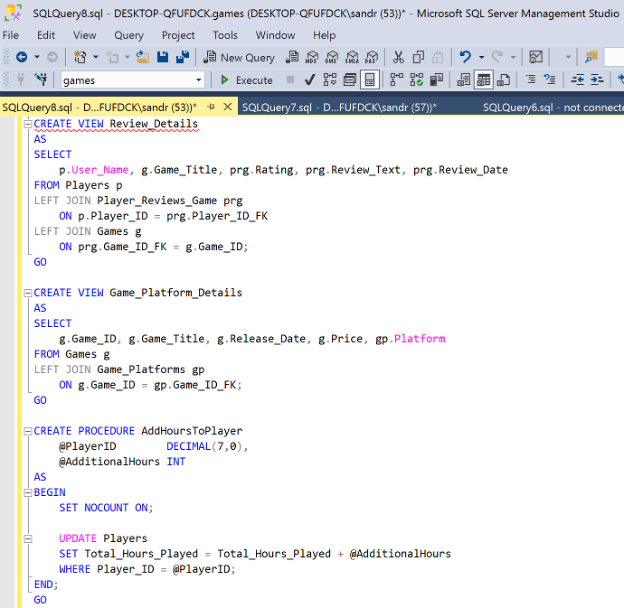
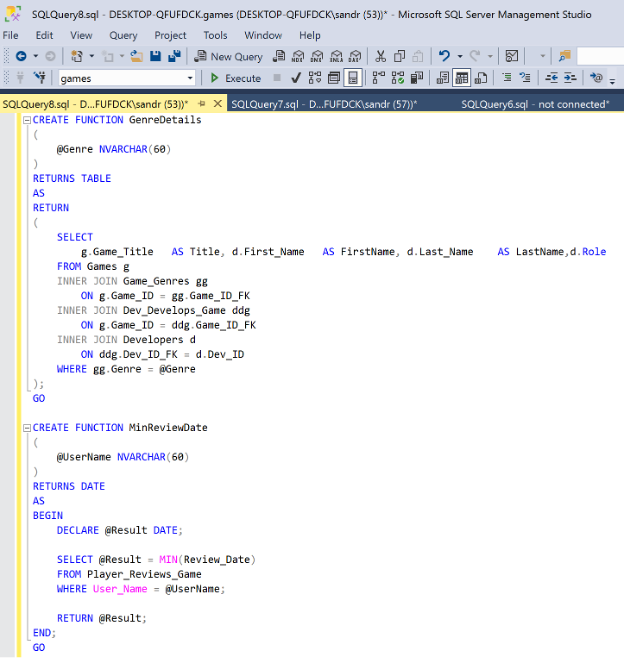

The project required the creation of the following SQL objects:

Create the following procedures, functions and views:

A view of players and their reviews. It should include all players (even ones without reviews). The columns should be the player's Username, the Title of the game, the Rating, the Review Text and the Review Date. Call this view Review_Details.
A view of games and platforms. It should include all of the game details and the platforms they are available on (Game ID, Title, Release Date, Price and Platform). Call this view Game_Platform_Details.
A procedure that receives how many additional hours a player played since the last update and updates the player's total hours played. The procedure should take a player ID and an integer (that represents the additional hours) and update the total hours played accordingly. Call this procedure AddHoursToPlayer.
A function that receives a genre and returns a table with all the games in that genre, the names of the developers that worked on it and their roles in the development. Call this function GenreDetails. (It should have the columns Title, FirstName, LastName and Role).
A function that receives a Username and returns the earliest date on which that user wrote a review. Call this function MinReviewDate.

### Screenshot 1

### Screenshot 2

